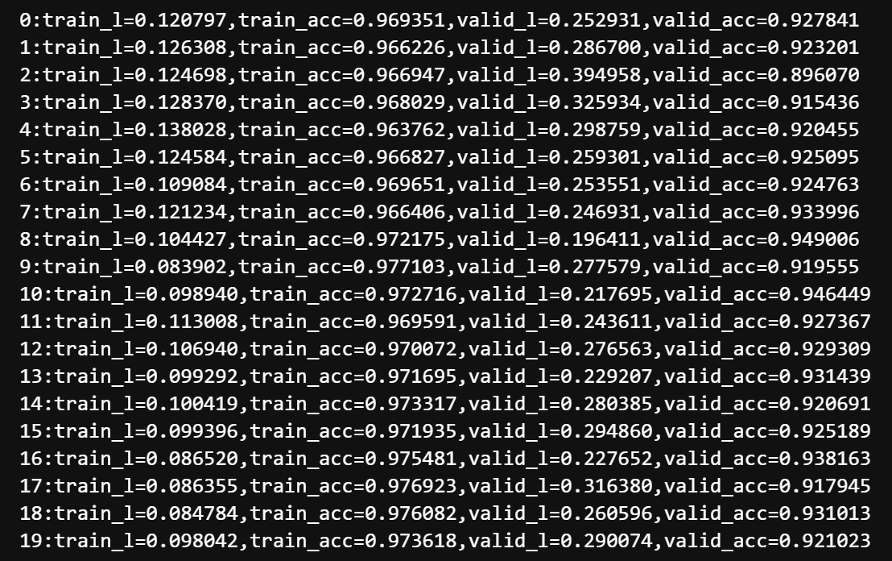

# Kaggle实战2：树叶分类

## 1 比赛介绍

竞赛地址：https://www.kaggle.com/competitions/classify-leaves/overview

竞赛任务是预测叶子图像的类别。该数据集包含 176 个类别、18353 张训练图像和 8800 张测试图像。每个类别至少有50张图片用于训练。
测试集平均分为公开和私有排行榜。

## 2 打怪升级记录

| 序号 |           epochs           |             学习率              | 优化器  |     网络架构     | 模型大小 |   分数    |
|:--:|:--------------------------:|:----------------------------:|:----:|:------------:|:----:|:-------:|
| 1  |             50             |            0.0001            | Adam | 预训练的resnet18 | 8KB  | 0.93636 |

## 3 炼丹

### `model1`

模型 1 是直接使用别人的一个 baseline，跑完提交后的分数还是挺高的，但是排行榜中很多人都达到了 0.98 以上的分数，所以还是有很大的提升空间的。

### `model2`

一开始换了 `resnet50` ，从训练过程可以明显的看出模型过拟合了。

所以这个模型相对于当前任务肯定太大，试一下 `resnet34`。

