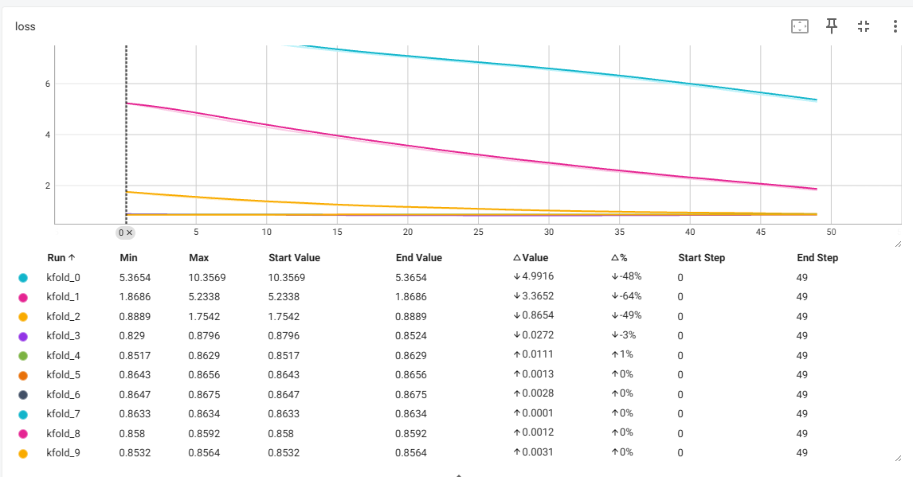
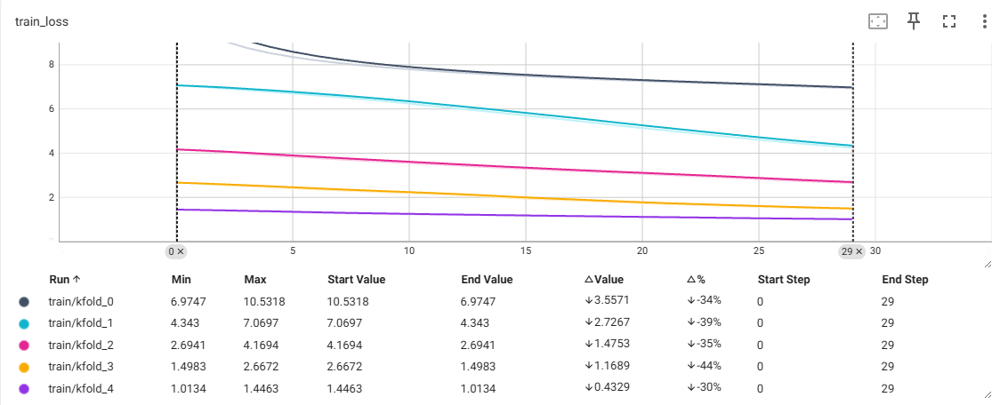
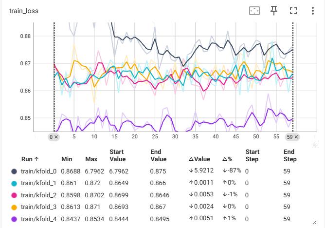
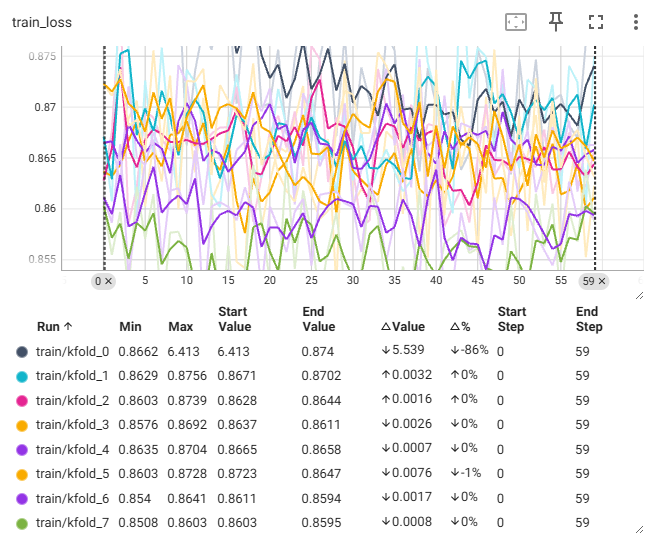
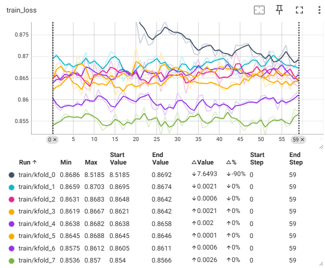
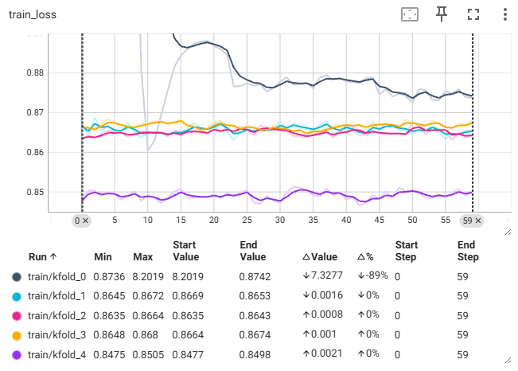

# Kaggle实战1：预测房价

竞赛地址：https://www.kaggle.com/c/california-house-prices/overview

## 1 打怪升级记录

| 序号 |          k-fold           |           epochs           |             学习率              | 优化器  | 网络架构  |            d_model            | 模型大小 |                分数                |
|:--:|:-------------------------:|:--------------------------:|:----------------------------:|:----:|:-----:|:-----------------------------:|:----:|:--------------------------------:|
| 1  |            10             |             30             |            0.003             | Adam | 2层全连接 |             [64]              | 8KB  |             0.98432              |
| 2  |            10             |             30             | 0.03 | Adam | 2层全连接 |             [64]              | 8KB  |  0.98693  |
| 3  |            10             |             30             |            0.003             | Adam | 2层全连接 | [128] | 13KB |  0.99144  |
| 4  |            10             |             30             |            0.003             | Adam | 2层全连接 |             [32]              | 6KB  | 0.98361 |
| 5  |            10             |             50             |            0.003             | Adam | 2层全连接 |             [32]              | 6KB  |             0.99559              |
| 6  | 5 | 30 |            0.003             | Adam | 2层全连接 |             [32]              | 6KB  | 0.87767 |

## 2 炼丹

一开始隐藏层维度是64，换成128分数降低了，说明过拟合数据了，之后换成32维，效果得到提升，说明对于这个数据集以及任务来说，32隐藏层大小的模型已经够用。

### 2.1 `model5`

可以看到训练的`loss`曲线在后面几个轮次的时候明显很平，感觉可能由于训练轮次过多，导致过拟合？

### 2.2 `model6`

考虑到可能过拟合，当我把训练的`k_fold`和`epoch`调小之后，最终的`score`达到了目前最低的0.87767，所以说之前明显过拟合了。

调整之后的训练曲线如下：

### 2.3 `model7`

这次考虑到是不是模型太过简单，只有1个隐藏层，尝试增加一下模型的复杂度。跑了一下，发现很容易过拟合，如下：

如上图所示，为什么震荡的这么厉害，最后`score`也只有1.006。

可以观察到每折训练的`loss`一定程度上是在下降的，所以可以试试增加一下`k_fold`。

这个结果就离谱...

抖动的这么厉害，是不是学习率太高了，现在是0.003，调成0.001试试，结果如下：

改了之后确实抖动的没有那么厉害了，但是感觉第一轮的训练结果挺好，只把第一轮的模型结果保存下来看看效果怎么样。

测试了第一轮的模型结果还是不行，难不成因为模型相对于当前这个数据集来说太大了，试着把模型改小一点。

改小了还是那样，效果一般，分析一下：可以看到`loss`曲线在后面几轮的时候几乎不再下降，感觉现在的`loss`还是有些高的，所以可以试一个小模型，看能达到多少的`loss`。

