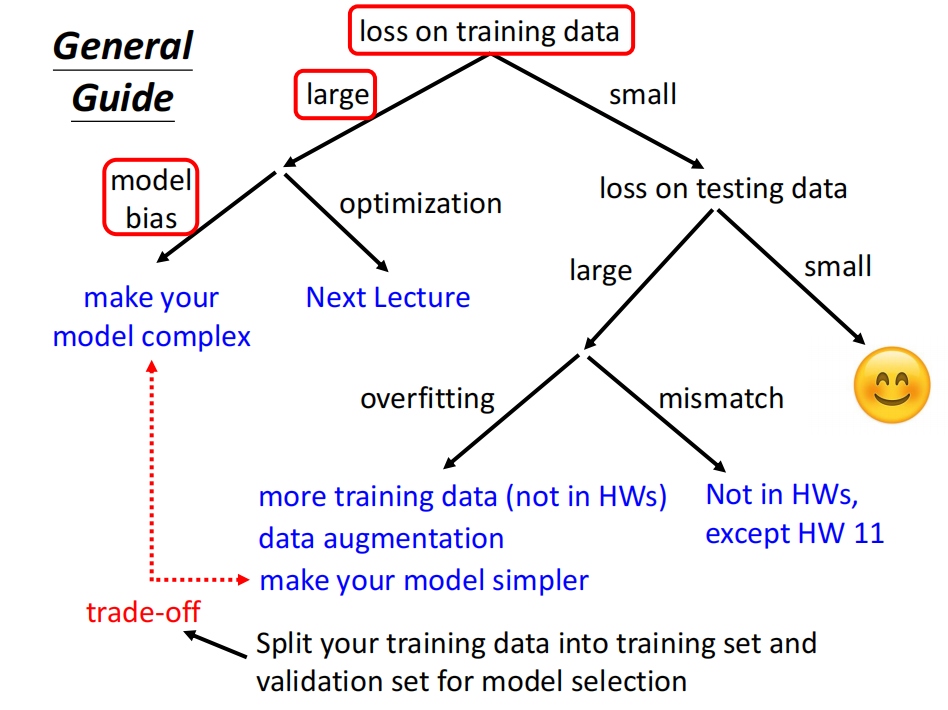
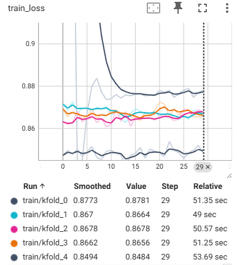
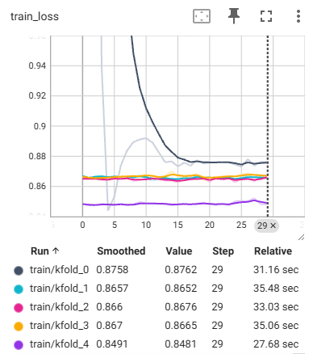
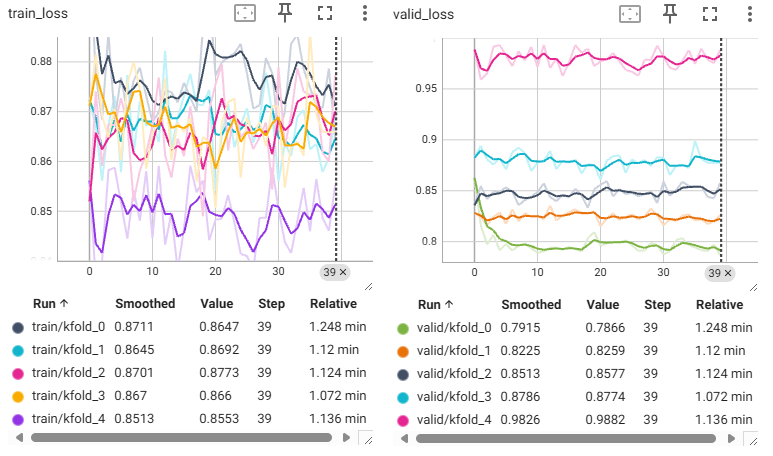
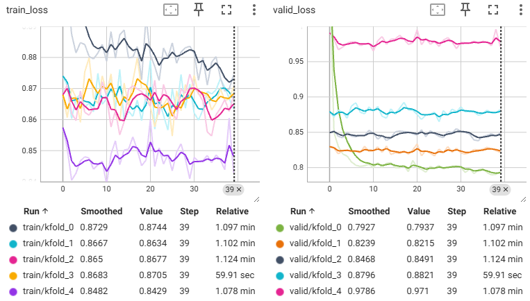

# Kaggle实战1：预测房价

## 1 比赛介绍

竞赛地址：https://www.kaggle.com/c/california-house-prices/overview

提交的内容将根据预测值的对数与观察到的销售价格的对数之间的均方根误差 （RMSE） 进行评估。（获取对数意味着预测 昂贵房屋 和 廉价房屋 的错误将对结果产生同等影响。

$$\mathrm{RMSD}(\hat{\theta})=\sqrt{\mathrm{MSE}(\hat{\theta})}=\sqrt{\mathrm{E}((\hat{\theta}-\theta)^2)}.$$



## 2 打怪升级记录

| 序号 |          k-fold           |           epochs           |             学习率              | 优化器  | 网络架构  |            d_model            | 模型大小 |                分数                |
|:--:|:-------------------------:|:--------------------------:|:----------------------------:|:----:|:-----:|:-----------------------------:|:----:|:--------------------------------:|
| 1  |            10             |             30             |            0.003             | Adam | 2层全连接 |             [64]              | 8KB  |             0.98432              |
| 2  |            10             |             30             | <font color=Blue>0.03</font> | Adam | 2层全连接 |             [64]              | 8KB  |  <font color=Red>0.98693</font>  |
| 3  |            10             |             30             |            0.003             | Adam | 2层全连接 | <font color=Blue>[128]</font> | 13KB |  <font color=Red>0.99144</font>  |
| 4  |            10             |             30             |            0.003             | Adam | 2层全连接 |             [32]              | 6KB  | <font color=Green>0.98361</font> |
| 5  |            10             |             50             |            0.003             | Adam | 2层全连接 |             [32]              | 6KB  |             0.99559              |
| 6  | <font color=Blue>5</font> | <font color=Blue>30</font> |            0.003             | Adam | 2层全连接 |             [32]              | 6KB  | <font color=Green>0.87767</font> |

## 3 炼丹

一开始隐藏层维度是64，换成128分数降低了，说明过拟合数据了，之后换成32维，效果得到提升，说明对于这个数据集以及任务来说，32隐藏层大小的模型已经够用。

### 3.1 `model5`

可以看到训练的`loss`曲线在后面几个轮次的时候明显很平，感觉可能由于训练轮次过多，导致过拟合？


### 2.2 `model6`

考虑到可能过拟合，当我把训练的`k_fold`和`epoch`调小之后，最终的`score`达到了目前最低的0.87767，所以说之前明显过拟合了。

调整之后的训练曲线如下：


### 2.3 `model7`

这次考虑到是不是模型太过简单，只有1个隐藏层，尝试增加一下模型的复杂度。跑了一下，发现很容易过拟合，如下：


如上图所示，为什么震荡的这么厉害，最后`score`也只有1.006。

可以观察到每折训练的`loss`一定程度上是在下降的，所以可以试试增加一下`k_fold`。


这个结果就离谱...

抖动的这么厉害，是不是学习率太高了，现在是0.003，调成0.001试试，结果如下：


改了之后确实抖动的没有那么厉害了，但是感觉第一轮的训练结果挺好，只把第一轮的模型结果保存下来看看效果怎么样。

测试了第一轮的模型结果还是不行，难不成因为模型相对于当前这个数据集来说太大了，试着把模型改小一点。


改小了还是那样，效果一般，分析一下：可以看到`loss`曲线在后面几轮的时候几乎不再下降，感觉现在的`loss`还是有些高的，所以可以试一个小模型，看能达到多少的`loss`。

当我把batch_size调至32之后，明显感觉到loss曲线更稳定了。



虽然loss曲线更稳定了，但是性能更低了，无语...再调大至64试试



可以看到曲线更稳定了，但是因为batch_size越来越大，导致性能有所降低。

结果如下，我不理解的是，为什么每到最后一折的验证集的精度总是会一下子下降？

```text
100%|██████████████████████████████████████████████| 40/40 [00:41<00:00,  1.03s/it]
折1，训练log mse:1.386252, 验证log mse:1.473956
100%|██████████████████████████████████████████████| 40/40 [00:40<00:00,  1.02s/it]
折2，训练log mse:0.980879, 验证log mse:0.972270
100%|██████████████████████████████████████████████| 40/40 [00:52<00:00,  1.30s/it]
折3，训练log mse:0.896742, 验证log mse:0.892156
100%|██████████████████████████████████████████████| 40/40 [01:07<00:00,  1.68s/it]
折4，训练log mse:0.880136, 验证log mse:0.878987
100%|██████████████████████████████████████████████| 40/40 [00:57<00:00,  1.44s/it]
折5，训练log mse:0.858226, 验证log mse:0.969959
```

会不会是这个模型的性能极限了？换成更大的模型试一下，模型定义如下：

```python
self.net = nn.Sequential(
    nn.Linear(dim, 32),
    nn.ReLU(),
    nn.Linear(32, 64),
    nn.ReLU(),
    nn.Linear(64, 16),
    nn.ReLU(),
    nn.Linear(16, 1)
)
```

又变成和以前一样，抖动的很厉害，而且出现了一个很奇怪的现象：验证集的损失越来越大。



首先抖动的厉害可以使用以下2种方法解决：

1. 减小学习率
2. 增大批次

可以看到曲线变得平滑了很多，训练集的损失不断下降，而验证集的损失不断升高？猜测是不是过拟合了？


修改后的模型结构如下：

```python
self.net = nn.Sequential(
    nn.Linear(dim, 32),
    nn.ReLU(),
    nn.Linear(32, 16),
    nn.ReLU(),
    nn.Linear(16, 8),
    nn.ReLU(),
    nn.Linear(8, 1)
)
```

结果如下，感觉还是过拟合了啊，再把模型改小一些。



